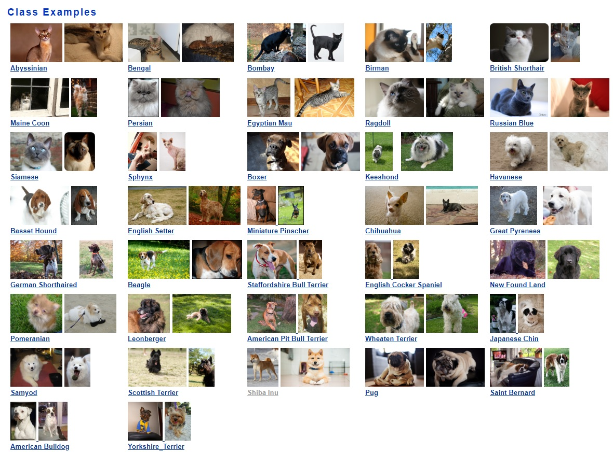

# Transfer learning using mobilenet and the Oxford IIIT Pets Dataset

This repository contains a notebook that will teach you how to train a [mobilenet](https://arxiv.org/abs/1704.04861) model using the [Oxford IIIT Pets Dataset](http://www.robots.ox.ac.uk/~vgg/data/pets/). This dataset contains pictures of 37 different breeds of cats and dogs:

Start this project in Azure Notebooks by clicking on this badge: 

# Setup

This demo has a number of steps that you'll need to complete to replicate what we did at the Connect() keynote.

## Azure Notebooks Setup

1. Sign up for an account on [Azure Notebooks](https://notebooks.azure.com) by logging in with either a Microsoft Account (e.g., an @outlook.com, an @live.com, or an @hotmail.com address) or an Azure Active Directory organization account (e.g., one from your workplace like @microsoft.com).
1. Open the [Github repository for the demo](https://github.com/Microsoft/connect-petdetector)
1. Scroll down until you see the Azure Notebooks|Launch badge and click on it to clone it into your Azure Notebooks account
1. If you haven't already, sign up for a [Free Azure Subscription](https://azure.microsoft.com/en-us/free/?v=18.45) which will give you $200 in Azure Credits to spend on training your models using GPUs over the first 30 days of your scription.
1. Open the [Azure Portal](https://portal.azure.com) and create an Ubuntu-based Data Science Virtual Machine (DSVM) using a GPU-powered Azure VM size. We used the [NC6](https://docs.microsoft.com/en-us/azure/virtual-machines/windows/sizes-gpu#nc-series) VM size in the Connect() demo, which is powered by an [NVidia K80 GPU](https://www.nvidia.com/en-gb/data-center/tesla-k80/).
1. Make sure that you set a username and password (not a SSH key) to log into your DSVM. You will use those same credentials when connecting to your VM from Azure Notebooks.
1. Navigate to the Azure Notebooks Project that you created. Click on the drop-down to select the DSVM that you created earlier, and click on the Run button to start it. In the dialog that appears, enter the username and password that you assigned when you created your DSVM.

